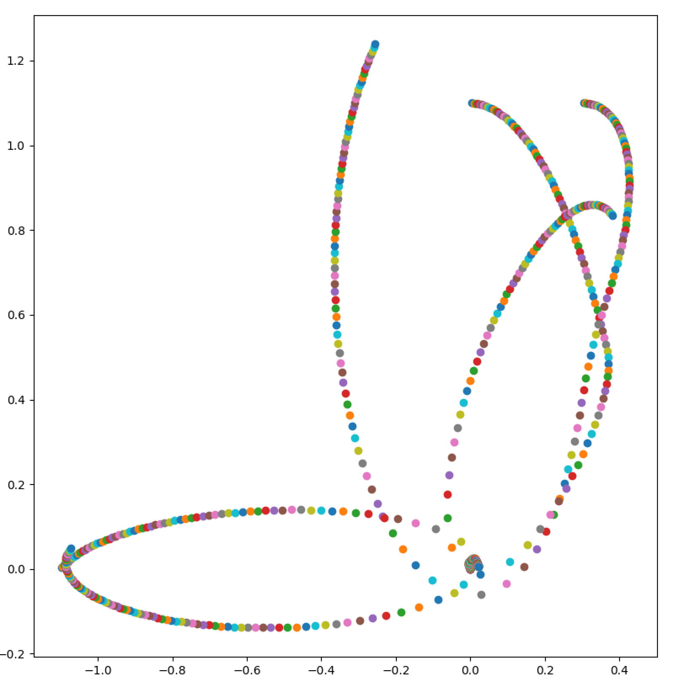

# Planet simulation

# Disclamer
Don't use this program, or use it as an example:
- it's missing an integration method
- it's not numerically stable
- it's slow

# How to use

Simply by `python3 planet.py`

## How to define planets

Planets are defined in the `planets` list

## Units
All the units are SI (m, kg, N)
